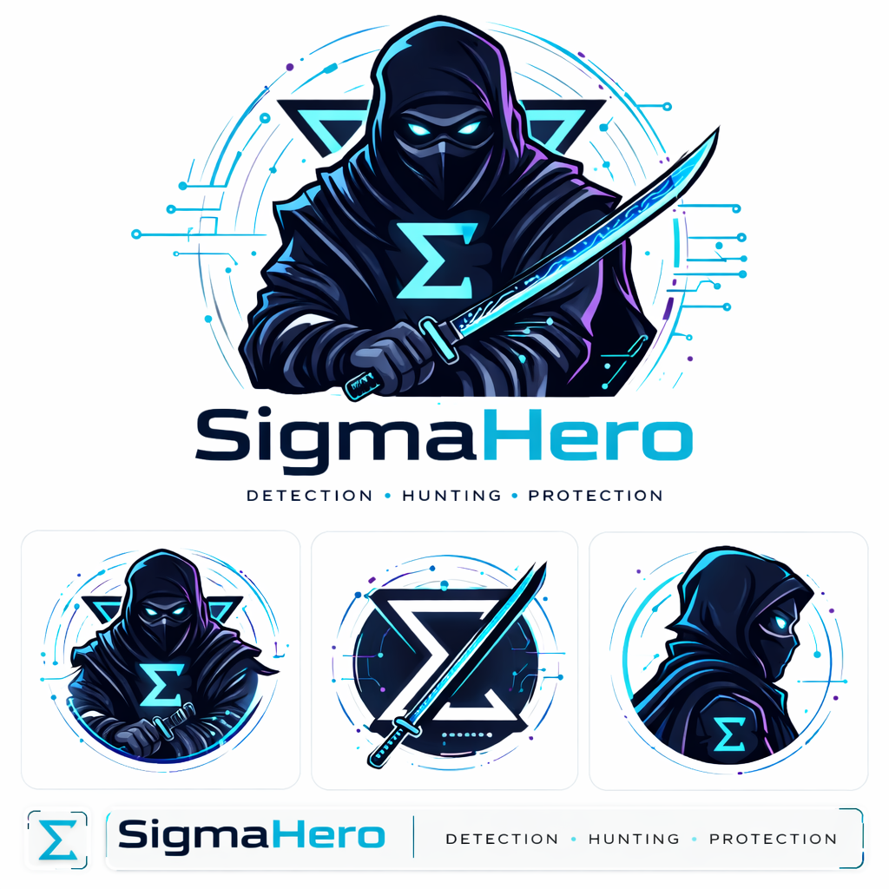

  

  <strong style="font-size:1.2em;">
    A synchronized repository on the <a href="https://detections.ai/">detections.ai</a> platform containing Sigma detection rules for the latest cybersecurity threats and CVEs
  </strong>

  
  

## 📌 Overview

**SigmaHero** is a centralized and **actively maintained repository** of Sigma detection rules for the latest cybersecurity threats and CVEs. It is specifically designed for **SOC analysts, threat hunters, and security engineers** to detect, investigate, and respond to malicious activity across **Windows, Linux, cloud, network, and identity platforms**.  

The rules are **carefully structured and categorized** for fast deployment, consistent implementation, and effective threat hunting workflows. SigmaHero aims to **streamline detection engineering**, reduce false positives, and provide actionable insights to strengthen security operations.

---

## 📚 Sigma Rules Overview

  

**Sigma** is an open standard for writing **generic, SIEM-independent detection rules**.  
It allows security teams to describe suspicious behaviors and attack patterns in a **structured YAML format** that can be converted to **specific SIEM queries** (like Splunk, Elastic, Microsoft Sentinel, or QRadar).  

Sigma rules help organizations:

- Define **consistent detection logic** for multiple environments  
- Share detection knowledge **across teams and communities**  
- Respond quickly to **emerging threats and CVEs**  
- Map detections to **MITRE ATT&CK techniques** for better visibility  

By using Sigma, analysts can **write once and deploy everywhere**, making detection engineering more scalable and collaborative.

---

## 🔄 detections.ai Sync

This repository is **synchronized with the [detections.ai](https://detections.ai/) platform**, ensuring it contains **up-to-date Sigma detection rules**.  
You can explore the rules, updates, and detailed metadata directly on detections.ai for the latest threat coverage and insights.

---

## 👤 Author

All detection rules in SigmaHero are authored by **Ilyess Sellami**.  
Follow him on detections.ai to see the latest contributions, updates, and rule enhancements:

- **Username:** [@ilyessellami](https://detections.ai/user/ilyessellami)  
- **Focus:** Detection Engineering, Threat Intelligence, Incident Response

---

## 📝 License

**SigmaHero** is released under the **MIT License**.  

You are free to use, copy, modify, merge, publish, distribute, sublicense, and/or sell copies of this repository, subject to the conditions of the MIT License.  

For full details, see the [LICENSE](LICENSE) file.
